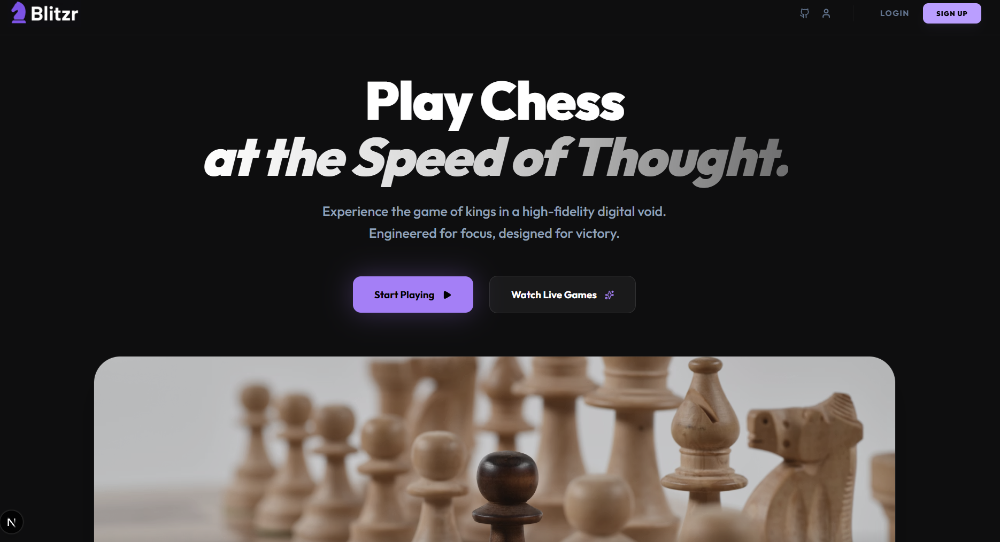
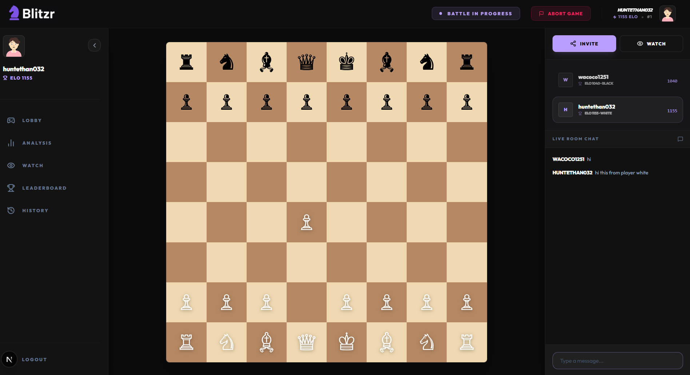
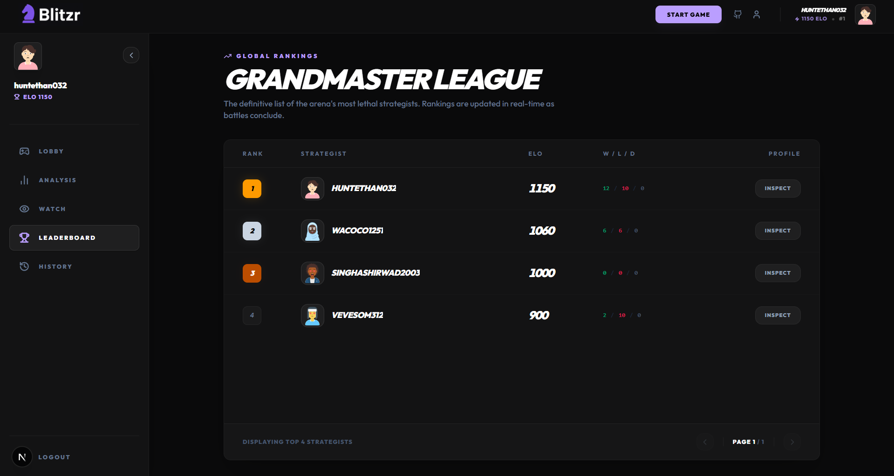
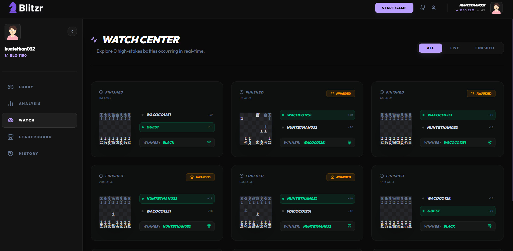
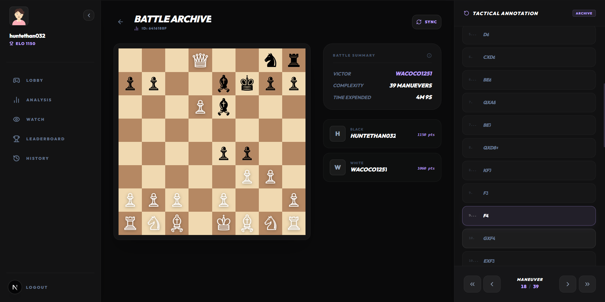
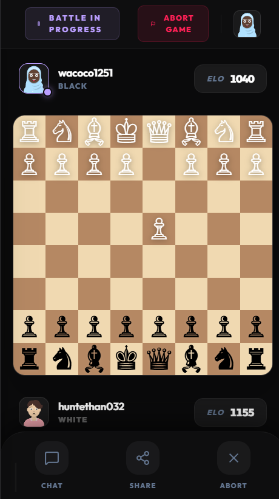
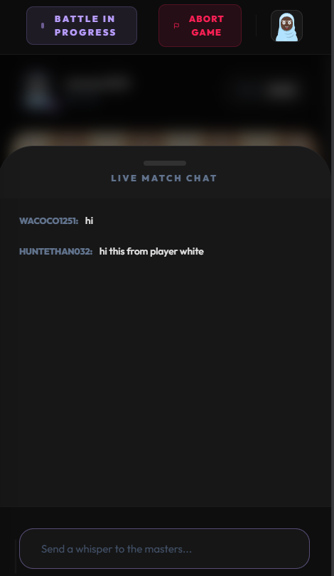
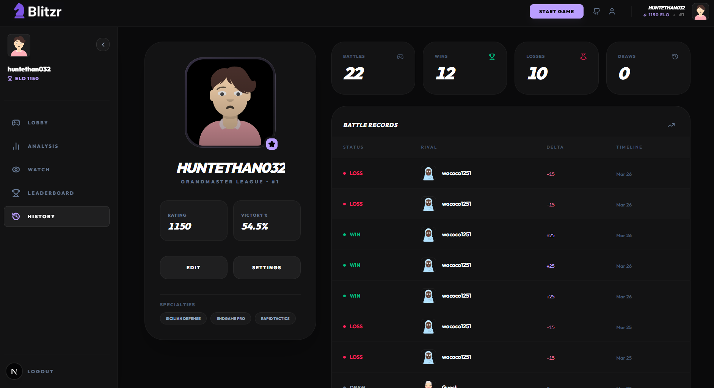

# Blitzr ♟️ a production-grade, real-time multiplayer chess platform.

## 🎥 Demo Preview

[](https://pub-4b0a8f18a97e4b44914872dd0d22870b.r2.dev/blog_demo/chess_demo_compress.mp4)

---

## ✨ Key Features

### ⚔️ Real-Time Multiplayer & Instant Room Sharing



### 📈 Global Elo Rating System


### 👁️ Live Spectator Mode


### 📜 Match Archives & Game History


### 🔍 Precision Analysis


### 📱 Fully Responsive UI & Chat 




### Profile Page


---

## 🛠️ Tech Stack

### **Frontend**
- Next.js 16 (App Router)
- Tailwind CSS 4
- Framer Motion
- Lucide React

### **Backend & Real-Time**
- Python 3.10+ (Core Engine)
- FastAPI (High-performance API)
- Python-Chess (Move validation & PGN)
- Python-SocketIO (ASGI Real-time server)
- Node.js & Socket.IO (Signal handling)
- Supabase (PostgreSQL, Auth & Real-time)

---

## 🚀 Getting Started

### Prerequisites
- Node.js (Latest LTS)
- Python 3.10+
- pnpm or npm

### Installation

1. **Clone the repository:**
   ```bash
   git clone https://github.com/Ethan4582/chess.com-blitzr.git
   cd blitzr
   ```

2. **Install Client:**
   ```bash
   cd client
   pnpm install
   ```

3. **Install Backend:**
   ```bash
   cd server
   pip install -r requirements.txt
   ```

4. **Start Blitzr:**
   ```bash
   # Terminal 1 (Client)
   pnpm dev
   
   # Terminal 2 (Server)
   python main.py
   ```

---

## 👨‍💻 Developer & Community

**Developed by:** [@Ethan4582](https://github.com/Ethan4582)  
**Stay Updated:** [@SinghAshir65848](https://x.com/SinghAshir65848)

### ☕ Support the Evolution
If you find Blitzr useful and want to support its development:
[**Buy Me a Coffee**](https://buymeacoffee.com/ashirwad05)

---

## 📄 License
MIT License